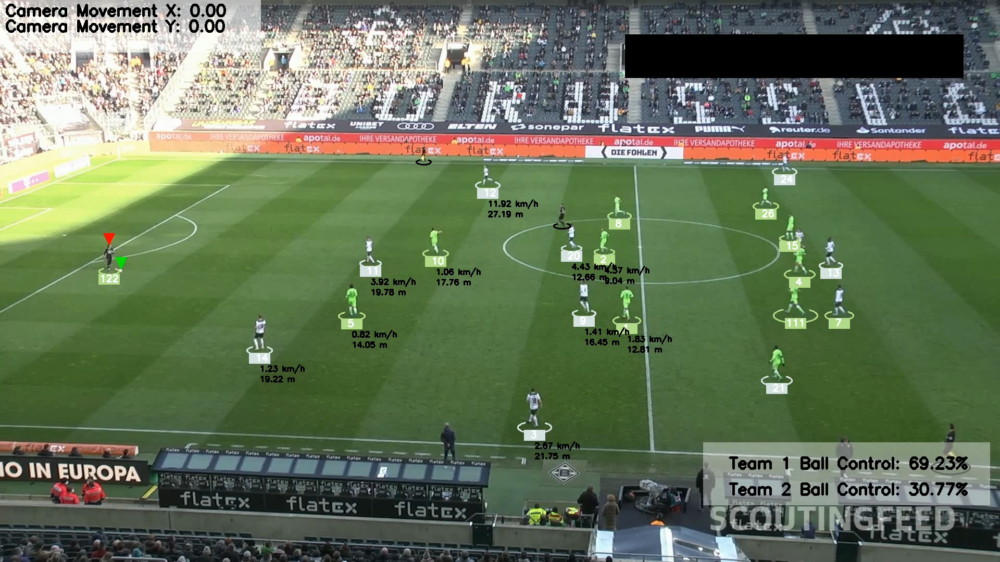

## The is an Football/Soccer Analysis System

- It can track Players and Ball
- Seggragate different teams
- Measure Player Speed even though the camera is moving using Perspective Tranform
- How much Active the player has been
- Calculate Ball Control of different teams

## Here is the Demo Image

## Informations

- For detection we used - YOLOv8  
- For tracking we used - Bytetrack
- To differtiate Players - Custom Detction model
- And OpenCV for Perspective tranform, speed calculation
